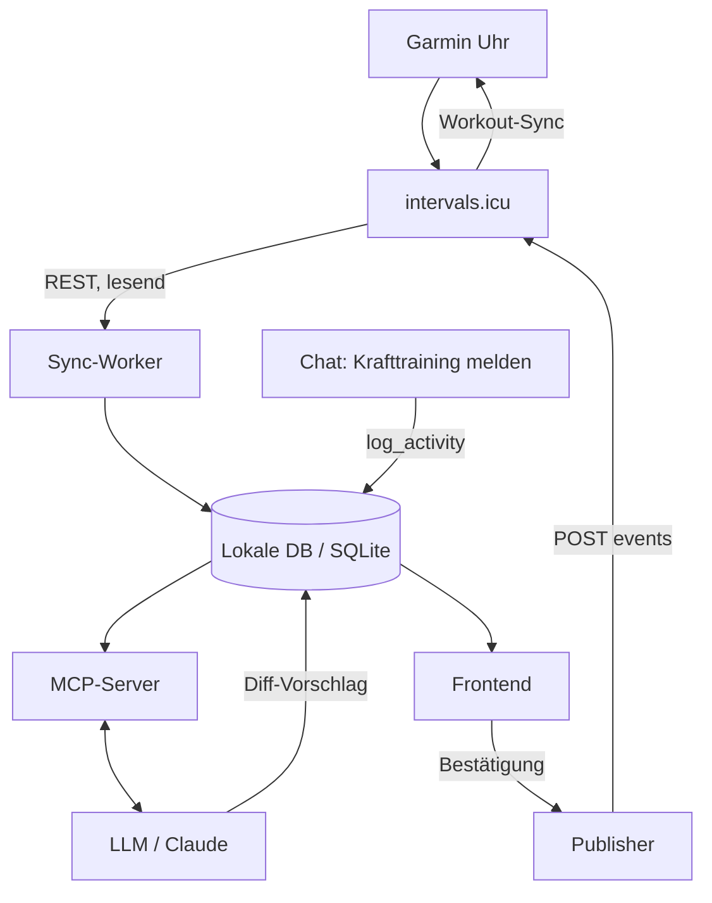
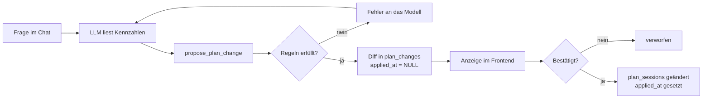

# Trainingssystem – Architektur

Stand: 27.09.2026 – nach Review und Umsetzung (siehe „Review-Ergebnis“ am Ende und README.md)

## Ziel und Abgrenzung

Ein persönliches Trainingssystem für einen Ausdauersportler, unabhängig von Sportart und Distanz: Trainingsdaten lokal halten, sie einem LLM über MCP zugänglich machen und daraus einen bearbeitbaren Trainingsplan pflegen.

**Das System tut:**

- Aktivitäten und Wellness-Daten aus intervals.icu in eine lokale Datenbank spiegeln
- Aktivitäten aufnehmen, die intervals.icu nicht gut abbildet (Krafttraining), per Chat erfasst
- abgeleitete Kennzahlen deterministisch berechnen: Form, Wochenlast, Zonenverteilung
- den Leistungszustand über Leistungstests messen und sichtbar machen: FTP, Schwellenpace, CSS, Schwellenpuls mit Verlauf und Gültigkeit
- Pläne auf Grundlage des letzten Leistungstests und des aktuellen Trainingsumfangs erzeugen, damit sie weder über- noch unterfordern
- Trainingspläne als Datenobjekte führen, jeder mit eigenem Ziel – ein Wettkampf mit Datum oder kontinuierliche Verbesserung ohne
- dem LLM erlauben, diesen Plan über eng geschnittene Werkzeuge zu ändern, als Vorschlag statt als Fakt
- bestätigte geplante Einheiten nach intervals.icu schreiben, von wo sie auf die Garmin synchronisieren

**Das System tut bewusst nicht:**

- keine Zwei-Wege-Synchronisierung von Aktivitäten. intervals.icu bleibt die Wahrheit für alles, was von der Uhr kommt
- keine Mehrbenutzerfähigkeit, kein Hosting für andere
- keine eigene Trainingswissenschaft. Übernommen statt erfunden werden: CTL und ATL als exponentielle Mittel über 42 und 7 Tage, die Belastung je Einheit aus den bereits von intervals.icu berechneten Werten, Session-RPE für alles ohne Messung, und gängige Progressionsregeln als konfigurierbare Grenzwerte
- keine autonome Planänderung. Jede Schreiboperation am Plan wird bestätigt
- kein Strava. Dessen API-Bedingungen untersagen das Einspeisen von Strava-Daten in ein LLM ausdrücklich

**Erfolgskriterium:** Nach einem vollständigen Trainingsblock läuft die Planung ohne Handarbeit – Einheiten landen auf der Uhr, jede Anpassung ist mit Begründung protokolliert und umkehrbar.

## Systemüberblick

Fünf Komponenten, ein gerichteter Datenfluss. Nur an einer Stelle wird nach außen geschrieben, und nur nach Bestätigung.



| Komponente | Aufgabe | Technik |
| --- | --- | --- |
| Sync-Worker | intervals.icu abfragen, normalisieren, inkrementell schreiben | Python, httpx, Cron |
| Lokale DB | einzige Lesequelle für alles Weitere | SQLite, später DuckDB für Auswertungen |
| Kennzahlen-Layer | Form, Wochenlast, Zonen, Trends, Trainingsumfang; rein deterministisch | Python, pandas |
| Leistungstests | Protokolle, Schwellenwerte, Gültigkeit, Zonen | Python |
| Plan-Engine | Periodisierung, Wochenziele, Lastkorridor, Wochengenerator, Regeln | Python, JSON-Vorlagen |
| MCP-Server | grob geschnittene Werkzeuge für Lesen, Loggen, Planänderung | Python, MCP SDK, stdio |
| Frontend | Kalender, Formkurve, Diff-Bestätigung | FastAPI + HTMX |

**Leitregel:** Das LLM sieht die DB ausschließlich durch den MCP-Server und schreibt nur über Werkzeuge, die validieren. Es bekommt keinen SQL-Zugriff und keine Rohtabellen.

## Datenmodell

Neun Tabellen (Umsetzung: `src/bulltraining/db.py`). Die wichtigste Entscheidung steckt in `activities.source`: sie trennt gespiegelte von lokal erfassten Daten und macht den Sync ungefährlich.

```sql
CREATE TABLE activities (
  id            INTEGER PRIMARY KEY,
  source        TEXT NOT NULL,        -- 'intervals' | 'local'
  external_id   TEXT UNIQUE,          -- NULL bei source='local'
  start_date    TEXT NOT NULL,        -- ISO, lokale Zeit
  sport         TEXT NOT NULL,        -- run|ride|swim|strength|other
  name          TEXT,
  duration_s    INTEGER NOT NULL,
  distance_m    REAL,
  hr_avg        INTEGER,
  hr_max        INTEGER,
  power_avg     INTEGER,
  rpe           INTEGER,              -- 1..10, Pflicht bei strength
  load          REAL,                 -- Belastungspunkte
  load_method   TEXT,                 -- 'power'|'hr'|'srpe'
  is_endurance  INTEGER NOT NULL,     -- 1 = geht in Ausdauer-CTL ein
  possible_duplicate_of INTEGER REFERENCES activities(id),
  notes         TEXT,
  raw           TEXT,                 -- JSON-Blob der Quellantwort
  created_at    TEXT NOT NULL,
  updated_at    TEXT NOT NULL
);
CREATE INDEX idx_act_date ON activities(start_date);
CREATE INDEX idx_act_source ON activities(source);

CREATE TABLE wellness (
  date          TEXT PRIMARY KEY,
  hrv           REAL,
  resting_hr    INTEGER,
  sleep_h       REAL,
  weight_kg     REAL,
  ctl_icu       REAL,                 -- von intervals.icu übernommen
  atl_icu       REAL,
  raw           TEXT
);

CREATE TABLE plans (
  id            INTEGER PRIMARY KEY,
  name          TEXT NOT NULL,
  goal_type     TEXT NOT NULL,        -- 'event' | 'continuous'
  goal_date     TEXT,                 -- NULL bei goal_type='continuous'
  goal_kind     TEXT,                 -- 'triathlon_70.3'|'marathon'|'gran_fondo'|...
  sports        TEXT NOT NULL,        -- JSON-Array beteiligter Sportarten
  focus         TEXT,                 -- bei 'continuous': 'aerobic'|'ftp'|'speed'|'health'
  priority      TEXT,                 -- 'A'|'B'|'C', nur bei 'event'
  weekly_hours  REAL,
  available_days TEXT,                -- JSON: Tage und Zeitfenster je Sportart
  status        TEXT NOT NULL,        -- 'active'|'archived'
  created_at    TEXT NOT NULL
);

CREATE TABLE plan_sessions (
  id            INTEGER PRIMARY KEY,
  plan_id       INTEGER NOT NULL REFERENCES plans(id),
  date          TEXT NOT NULL,
  sport         TEXT NOT NULL,
  title         TEXT NOT NULL,
  description   TEXT,                 -- Intervals-Syntax für den Upload
  duration_s    INTEGER NOT NULL,
  target_load   REAL,
  intensity     TEXT,                 -- 'easy'|'tempo'|'threshold'|'vo2'|'long'
  status        TEXT NOT NULL,        -- 'planned'|'published'|'done'|'skipped'
  external_event_id TEXT,             -- id aus intervals.icu nach Upload
  activity_id   INTEGER REFERENCES activities(id),
  created_at    TEXT NOT NULL
);

CREATE TABLE plan_changes (
  id            INTEGER PRIMARY KEY,
  created_at    TEXT NOT NULL,
  actor         TEXT NOT NULL,        -- 'llm'|'human'
  tool          TEXT,                 -- aufgerufenes Werkzeug
  reason        TEXT NOT NULL,        -- Begründung des Modells
  diff          TEXT NOT NULL,        -- JSON: vorher/nachher
  applied_at    TEXT                  -- NULL = noch nicht bestätigt
);

CREATE TABLE sync_runs (
  id            INTEGER PRIMARY KEY,
  started_at    TEXT NOT NULL,
  finished_at   TEXT,
  provider      TEXT NOT NULL,
  from_date     TEXT,
  n_created     INTEGER,
  n_updated     INTEGER,
  error         TEXT
);

CREATE TABLE settings (
  key           TEXT PRIMARY KEY,
  value         TEXT NOT NULL         -- FTP, Schwellenpuls, Zonen, sRPE-Faktor
);
```

**Drei Festlegungen, die später Ärger sparen:**

1. `raw` hält die unveränderte Quellantwort. Wenn sich das Normalisieren als falsch erweist, lässt sich ohne erneuten API-Abruf nachziehen.
2. `is_endurance` ist ein eigenes Feld, keine Ableitung aus `sport`. Ein Ergometer-Test im Kraftraum kann Ausdauer sein, ein Zirkel mit Kettlebells nicht.
3. `plan_changes.applied_at` bleibt NULL, solange ein Vorschlag unbestätigt ist. Die Tabelle ist damit zugleich Änderungsprotokoll und Warteschlange.

**Ergänzungen in der Umsetzung** (das SQL oben ist der ursprüngliche Entwurf, maßgeblich ist `db.py`):

- `activities.excluded` nimmt eine Zeile aus *beiden* Lastkurven; `user_locked` schützt von Hand gesetzte Werte vor dem Resync; `zone_times` hält die Zonenzeiten aus intervals.icu.
- `duplicate_exceptions` ist die im Text geforderte Ausnahmeliste für „Kein Duplikat“.
- `plans.start_date` und `plans.baseline` halten Planbeginn und eine Momentaufnahme von Trainingsumfang und Tests bei Erstellung.
- `plan_sessions` bekommt `category` (`WORKOUT|RACE|TEST`), `race_priority`, `test_protocol`, `publish_error` und den Status `deleted` (veröffentlichte Einheit wartet auf Löschung in intervals.icu).
- `plan_changes` bekommt `plan_id`, `ops`, `warnings`, `status` (`pending|applied|rejected|reverted`) und `reverts_change_id` – verworfene und rückgängig gemachte Vorschläge sind sonst nicht unterscheidbar.
- `performance_tests`, siehe Abschnitt „Leistungstests und Leistungszustand“.

## Ziele und Pläne

Jeder Plan trägt genau ein Ziel. Der Zieltyp entscheidet, wie periodisiert wird – das ist der einzige strukturelle Unterschied zwischen den Plänen.

| | `goal_type = 'event'` | `goal_type = 'continuous'` |
| --- | --- | --- |
| Zieldatum | Pflicht | leer |
| Periodisierung | Grundlage, Aufbau, Spezifisch, Taper – rückwärts vom Datum gerechnet | rollende Blöcke, drei Wochen Aufbau, eine Woche Entlastung |
| Belastungsverlauf | ansteigend bis zur Spitze, dann Taper | wellenförmig um ein Zielniveau |
| Abschluss | Plan geht nach dem Wettkampf auf `archived` | läuft offen weiter |
| Steuergröße | Formzustand am Zieldatum | Trend von `ctl_endurance` über 12 Wochen |

**Zielarten (`goal_kind`)** sind eine offene Liste, kein Enum im Code: `triathlon_sprint`, `triathlon_olympic`, `triathlon_70.3`, `triathlon_full`, `marathon`, `half_marathon`, `10k`, `gran_fondo`, `cycling_ftp`, `swim_distance` und was sonst dazukommt. Was ein Zieltyp für die Wochenstruktur bedeutet – Verhältnis der Disziplinen, Länge der Schlüsseleinheiten, Mindestumfang – liegt als Vorlage je `goal_kind` vor, nicht als Logik im Code. Eine unbekannte Zielart fällt auf eine generische Vorlage zurück.

**Mehrere Pläne gleichzeitig** sind erlaubt, aber nur einer ist `active`. Nebenwettkämpfe sind keine eigenen Pläne, sondern Einträge im aktiven Plan mit Kategorie `RACE` und Priorität B oder C; sie verschieben die Belastung in ihrer Woche, nicht die Periodisierung.

**Übergang nach dem Ziel.** Ist ein Event-Plan abgelaufen, schlägt das System einen Nachfolgeplan vor: neues Event, wenn eines bekannt ist, sonst `continuous` mit dem erreichten Niveau als Ausgangspunkt. Ohne aktiven Plan arbeitet das System weiter, es plant nur nichts – Aufzeichnung, Kennzahlen und Auswertung laufen unabhängig vom Plan.

## Sync mit intervals.icu

Lesender Zugriff über die öffentliche REST-API, Basic Auth, Athleten-ID `0`.

**Authentifizierung:** API-Key unter `intervals.icu/settings` erzeugen, Abschnitt "Developer Settings". Benutzername ist die feste Zeichenkette `API_KEY`, Passwort der Schlüssel. Als Athleten-ID funktioniert `0`, was auf den Besitzer des Schlüssels auflöst. Endpunktreferenz: [api-docs.html](https://intervals.icu/api-docs.html).

| Zweck | Endpunkt |
| --- | --- |
| Aktivitätsliste | `GET /api/v1/athlete/0/activities` |
| Aktivität mit Intervallen | `GET /api/v1/activity/{id}?intervals=true` |
| Wellness (HRV, Ruhepuls, Schlaf, CTL/ATL) | `GET /api/v1/athlete/0/wellness` |
| Geplante Einheiten lesen | `GET /api/v1/athlete/0/events?oldest=&newest=` |
| Geplante Einheit anlegen | `POST /api/v1/athlete/0/events` |
| Workout als Datei ziehen | `GET /api/v1/athlete/0/events/{id}/download.zwo` |

**Zwei Fallstricke:**

- **Cloudflare.** intervals.icu läuft dahinter, und Anfragen mit dem Standard-User-Agent von `Python-urllib` gelten als verdächtig und werden gefordert oder blockiert. Lösung: browserähnlichen User-Agent setzen.
- **Rate Limits.** Für API-Key-Aufrufe gelten 5.000 Anfragen pro Tag und 2.500 pro rollendem 15-Minuten-Fenster, dazu höchstens 10 pro Sekunde und IP. Die Antwortheader `X-RateLimit-Limit` und `X-RateLimit-Remaining` melden den Stand; bei Überschreitung kommt Status 429 mit `Retry-After` in Sekunden.

**Ablauf des Workers:**

1. `sync_runs`-Zeile anlegen, `from_date` = jüngstes `start_date` mit `source='intervals'` minus 7 Tage Überlappung
2. Aktivitätsliste holen, pro unbekannter `external_id` das Detail mit `intervals=true` nachladen
3. Upsert auf `external_id`; `raw` immer mitschreiben
4. Wellness für denselben Zeitraum holen, Upsert auf `date`
5. Dublettenprüfung gegen lokale Zeilen (nächster Abschnitt)
6. `sync_runs` abschließen, bei Fehler Text in `error` und Abbruch ohne Teilcommit

Die Überlappung von sieben Tagen fängt nachträglich korrigierte Aktivitäten ab. Zeilen mit `source='local'` werden dabei nie angefasst.

## Lokale Aktivitäten und Dubletten

Krafttraining und alles, was intervals.icu nicht sauber abbildet, wird per Chat gemeldet und landet mit `source='local'` direkt in der DB.

**Die harte Regel:** Der Sync liest und schreibt ausschließlich Zeilen mit `source='intervals'`. Lokale Zeilen sind für ihn unsichtbar. Ohne diese Trennung räumt der erste vollständige Resync die selbst erfassten Einheiten weg.

**Dubletten entstehen zeitversetzt.** Wird die Uhr beim Krafttraining getragen, erscheint dieselbe Einheit Stunden später über intervals. Deshalb wird nicht beim Einfügen geprüft, sondern bei jedem Sync-Durchlauf.

Kandidatenerkennung: gleicher Tag, gleiche Sportart, Dauer innerhalb von ±15 Minuten. Treffer werden nicht automatisch zusammengeführt, sondern bekommen `possible_duplicate_of` gesetzt und erscheinen im Frontend zur Auflösung. Automatisches Mergen ist beim ersten Fehlalarm bereut: zwei echte Einheiten am selben Tag sind im Triathlon normal.

Drei Auflösungen im Frontend, jeweils ein Klick:

- **Externe behalten** – lokale Zeile löschen, die genauere Messung gewinnt
- **Lokale behalten** – externe Zeile auf `is_endurance=0` setzen und aus der Lastrechnung nehmen
- **Kein Duplikat** – Markierung entfernen, Paar in einer Ausnahmeliste merken, damit es nicht erneut vorgeschlagen wird

**Erfassung per Chat.** Das Werkzeug `log_activity` nimmt Datum, Sportart, Dauer, RPE, optional Puls und Notiz. Zwei Regeln für das Modell: Fehlt die RPE, wird nachgefragt statt geschätzt. Und die Antwort enthält immer die eingefügte Zeile zur Kontrolle, damit sichtbar wird, wie "45 Minuten Oberkörper, war zäh" interpretiert wurde.

## Belastungsmodell

Zwei Formkurven statt einer. Ausdauerlast bleibt mit intervals.icu vergleichbar, Gesamtlast bildet die tatsächliche Beanspruchung ab.

| Kurve | Eingang | Zweck |
| --- | --- | --- |
| `ctl_endurance` | nur Aktivitäten mit `is_endurance=1` | Vergleichbarkeit mit intervals.icu, Steuerung der Ausdauerprogression |
| `ctl_total` | alle Aktivitäten inklusive Kraft | Ermüdungsbild, Grundlage für Empfehlungen zu Regeneration |

Werden beide in einen Topf geworfen, ist der CTL-Wert nicht mehr mit dem in intervals sichtbaren vergleichbar, und nach drei Monaten ist nicht mehr rekonstruierbar, warum.

**Berechnung.** Beide Kurven sind exponentiell gewichtete gleitende Mittelwerte der Tagesbelastung, CTL über 42 Tage, ATL über 7 Tage, Form als Differenz der Vortageswerte. In pandas über `Series.ewm(alpha=1/42, adjust=False)` bzw. `alpha=1/7` – **nicht** `halflife=42`: das entspräche einer Zeitkonstante von rund 61 Tagen und wiche sichtbar von intervals.icu ab. Der Tagesindex ist lückenlos mit Nullen an trainingsfreien Tagen und beginnt einen Tag *vor* der ersten Aktivität, weil `adjust=False` sonst mit dem ersten Tageswert statt mit 0 startet.

**Belastung je Quelle.** Das Feld `load_method` hält fest, wie ein Wert zustande kam:

- `power` – aus normalisierter Leistung und FTP, für Radeinheiten mit Leistungsmesser. Von intervals.icu übernommen statt selbst gerechnet.
- `hr` – aus Herzfrequenz und Schwellenpuls, für Laufen und Schwimmen ohne Leistungsdaten. Ebenfalls übernommen.
- `srpe` – Session-RPE für Kraft und alles ohne verwertbare Messung: RPE mal Dauer in Minuten. Etabliertes Verfahren, aber eine andere Einheit als die beiden oberen.

**Kalibrierung.** sRPE-Punkte und Ausdauerlast sind nicht ohne Weiteres gleich skaliert. Ein Faktor in `settings` rechnet sRPE auf die Ausdauerskala um; Startwert **0,2** (eine Stunde an der Schwelle sind 100 Lastpunkte, als sRPE aber 7–8 × 60 = 420–480), nach vier Wochen anhand vergleichbarer Einheiten nachjustieren. Der Faktor gehört in die Einstellungen, nicht in den Code. In der DB steht der Rohwert; der Faktor wird erst in der Auswertung angewendet, damit eine spätere Korrektur rückwirkend konsistent ist.

`load_method` kennt zusätzlich `icu`: intervals.icu liefert eine Last, aber weder Leistung noch Puls (z. B. aus Pace berechnet).

**Offene Datenlücken, bewusst eingeplant:** Beim Schwimmen ist die Herzfrequenz je nach Setup gar nicht vorhanden. Fehlt sie, fällt die Einheit automatisch auf `srpe` zurück. Deshalb ist RPE bei jeder Einheit erfassbar, nicht nur bei Kraft.

## MCP-Werkzeuge

Grob geschnitten, nicht fein. Der Engpass ist das Kontextfenster, nicht die API: Muss sich das Modell Kennzahlen aus Rohdaten zusammenrechnen, wird es langsam, teuer und ungenau.

| Werkzeug | Art | Rückgabe |
| --- | --- | --- |
| `get_form_state()` | lesend | beide CTL-Werte, ATL, Form, HRV-Abweichung von der Baseline, aktiver Plan mit Ziel und – falls gesetzt – Tagen bis zum Zieldatum |
| `get_week_summary(week)` | lesend | Dauer und Last je Sportart, geplant gegen absolviert |
| `get_zone_distribution(days)` | lesend | Zeit je Intensitätszone über den Zeitraum |
| `get_wellness_trend(days)` | lesend | HRV, Ruhepuls, Schlaf als Reihe plus Baseline |
| `get_plan(from, to)` | lesend | geplante Einheiten mit Status |
| `get_activity(id)` | lesend | eine Aktivität im Detail, für den Einzelfall |
| `log_activity(...)` | schreibend, lokal | eingefügte Zeile zur Kontrolle |
| `update_activity(id, ...)` | schreibend, lokal | geänderte Zeile |
| `propose_plan_change(ops, reason)` | schreibend, Vorschlag | Diff-Objekt, unbestätigt |
| `get_performance_state()` | lesend | Testwerte mit Verlauf, Gültigkeit je Sportart, Zonen, Abgleich mit intervals.icu, Testprotokolle |
| `record_performance_test(date, protocol, inputs)` | schreibend, lokal | abgeleitete Schwellen, vorher/nachher |
| `get_training_load_context(week)` | lesend | aktueller Trainingsumfang, Acute:Chronic, Wochenziel und Lastkorridor |
| `get_pending_changes()` | lesend | offene Vorschläge |

**Planänderungen laufen über `propose_plan_change`**, das eine Liste eng typisierter Operationen entgegennimmt: `move_session`, `swap_days`, `change_duration`, `change_intensity`, `insert_recovery_day`, `regenerate_week`, `delete_session`, dazu `schedule_test` und `add_race` (B/C-Rennen). Freier Text ist keine Operation.

Der Grund: Erzeugt das Modell den Plan als Prosa, gibt es keine Versionierung, kein Undo und keine Nachvollziehbarkeit. Über Operationen entsteht ein Änderungsprotokoll mit Zeitstempel, Begründung und Vorher-Nachher-Stand. Das ist am Ende der Teil, der dieses System von einer gekauften Plattform unterscheidet.

**Validierung im Werkzeug, nicht im Prompt.** Jede Operation wird gegen harte Regeln geprüft, bevor sie überhaupt als Vorschlag gespeichert wird:

- Wochenlast im Lastkorridor (siehe „Trainingsumfang und Lastkorridor“): Überschreiten blockiert, Unterschreiten erzeugt einen Hinweis
- lange Einheiten höchstens x % über der längsten Einheit der letzten Wochen
- höchstens zwei bis drei harte Tage pro Woche, nie zwei in Folge (auch über die Wochengrenze)
- mindestens ein vollständig freier Tag pro Woche
- bei Plänen mit Zieldatum ist das Taper-Fenster für Belastungssteigerungen gesperrt; Kürzen, Entlasten und Löschen bleiben erlaubt, sonst ließe sich im Taper nicht einmal auf Krankheit reagieren
- keine Einheit in der Vergangenheit ändern
- Schwelle/VO2 ohne jeden Leistungstest der Sportart: Hinweis

Verstößt eine Operation, gibt das Werkzeug einen Fehler mit Begründung zurück. Das Modell liest ihn und korrigiert selbst. Regeln im Systemprompt statt im Code werden dagegen früher oder später ignoriert.

## Planmodell und LLM-Bearbeitung

Der Plan ist ein Datenobjekt in `plan_sessions`, kein Text. Das Modell schlägt Änderungen vor, angewendet werden sie erst nach Bestätigung.



**Beispiel eines Diffs, wie er im Frontend erscheint:**

> Dienstag Schwimmen nach Mittwoch verschieben, Donnerstag Intervalle von 60 auf 45 Minuten kürzen. Grund: HRV drei Tage unter Baseline, Wochenlast bereits 12 Prozent über Vorwoche.

**Warum kein Autopilot:** Ein Agent, der ungefragt den Trainingskalender umbaut, ist nach zwei Wochen nervig und nach vier gefährlich. Die Bestätigung kostet fünf Sekunden und hält den Menschen in der Verantwortung für sein Training.

**Plangenerierung.** Ein neuer Block entsteht über `regenerate_week` für jede Woche einzeln, nicht als ein Aufruf über den gesamten Zeitraum. Der Rahmen kommt aus dem aktiven Plan: Zieltyp, Zieldatum falls vorhanden, Zielart, Wochenstunden und verfügbare Tage je Sportart. Ohne übergebene Einheiten füllt ein deterministischer Generator die Woche (`generator.py`); das Modell kann alternativ eigene Einheiten übergeben – beide Wege laufen durch dieselben Regeln. Es ist immer nur eine Wochengenerierung offen, weil die Folgewoche auf der bestätigten Vorwoche als Referenz aufbaut. Die Periodisierung gibt die Vorlage zur Zielart vor (`plan_templates/*.json`), nicht das Modell.

**Kontextstrategie.** Das Modell bekommt pro Anfrage höchstens: aktueller Formzustand, die letzten vier Wochenzusammenfassungen, Zonenverteilung über 28 Tage, Wellness-Trend über 14 Tage, Plan für zwei Wochen voraus. Alles Weitere holt es sich bei Bedarf über `get_activity`. Keine Rohtabellen im Kontext.

## Leistungstests und Leistungszustand

Kennzahlen wie CTL beschreiben, wie viel trainiert wurde, aber nicht, wie leistungsfähig der Athlet ist. Das misst ein Leistungstest. Er ist deshalb die zweite Säule neben der Belastung und die Grundlage jedes Plans.

**Protokolle** (gängige Feldtests, Formeln übernommen statt erfunden):

| Protokoll | Sportart | Messwerte | Ergebnis |
| --- | --- | --- | --- |
| `ride_ftp20` | Rad | Ø Leistung 20 min | FTP = 95 % |
| `ride_ramp` | Rad | beste 1-min-Leistung | FTP = 75 % |
| `run_30min_tt` | Lauf | Strecke in 30 min, Ø Puls letzte 20 min | Schwellenpace, Schwellenpuls |
| `run_5k_tt` | Lauf | 5-km-Zeit | Schwellenpace über Riegel auf 60 min (Schätzung) |
| `swim_css` | Schwimmen | Zeiten 400 m und 200 m | CSS = (t400 − t200) / 2 je 100 m |

Jeder Test landet in `performance_tests`, Messwerte und Ergebnis getrennt und plausibilitätsgeprüft. Ist er der jüngste seiner Art, übernimmt das System die Schwellenwerte in `settings`; die Historie bleibt erhalten. Ein am selben Tag geplanter `TEST`-Eintrag geht damit auf `done`. Messwerte werden erfragt, nie geschätzt.

**Gültigkeit.** Ein Test gilt `test_validity_days` (Standard 56) Tage. Status je Sportart: `valid`, `due_soon` (letzte 14 Tage), `stale`, `missing`.

**Leistungszustand** (`get_performance_state`, Ansicht „Leistung“): aktueller Wert je Kennzahl, Veränderung zum Vortest mit Richtung (bei Pace und CSS ist kleiner besser), Verlauf, Gültigkeit, W/kg, daraus abgeleitete Zonen, CTL und Form als Fitnesskontext. Dazu ein Abgleich mit den Schwellen, mit denen intervals.icu zuletzt gerechnet hat: weichen sie ab, rechnen Uhr und Plan mit unterschiedlichen Zielen, und das wird angezeigt.

**Tests als Grundlage des Plans:**

- Fehlt für eine Sportart des Plans jeder Test, setzt der Generator ihn in die nächste Woche (nicht im Taper) und plant für diese Sportart bis zum Ergebnis keine Schwellen- oder VO2-Einheiten.
- Ist der Test veraltet, wird er ebenfalls neu angesetzt; Qualitätseinheiten laufen mit dem alten Wert und einem Hinweis weiter, damit ein verschobener Test nicht wochenlang jede Intensität stoppt.
- Ein Retest fällt in die Entlastungswoche vor Ablauf: ausgeruht testen, ohne einen Belastungsblock zu stören.
- Zielbereiche in den Workout-Beschreibungen sind Prozent der getesteten Schwelle (Rad `% FTP`, Lauf und Schwimmen `% Pace`), die absoluten Werte stehen als Kommentarzeile dabei. Ohne Test fällt die Beschreibung auf Pulszonen zurück.

## Trainingsumfang und Lastkorridor

Ein Plan soll dort anfangen, wo der Athlet steht, nicht beim Wunschumfang. Drei Größen steuern das:

1. **Aktueller Umfang** (`training_baseline`): Ausdauerstunden und -last der letzten vier abgeschlossenen Wochen, je Sportart Stunden, Häufigkeit und längste Einheit, Acute:Chronic-Verhältnis.
2. **Referenz je Woche** (`reference_week`): Maximum aus letzter Belastungswoche und chronischem Schnitt der vier Vorwochen. Vergangene Tage zählen mit tatsächlich Absolviertem, künftige mit dem Plan. Eine Entlastungs- oder Krankheitswoche zieht die Referenz nicht nach unten.
3. **Lastkorridor** (`load_corridor`):
   - Obergrenze = min(Referenz × (1 + `max_weekly_load_increase_pct`), 1,3 × chronische Last, Last, die CTL um mehr als `max_ctl_ramp_per_week` höbe)
   - Untergrenze in Belastungswochen = `underload_min_pct` × chronische Last

**Wochenziele** (`week_targets`): Belastungswoche = Referenzstunden + 10 % bis zum Zielumfang des Plans (nach einer Entlastungswoche + 5 %), Entlastungswoche 65 %, Taper 75 % bzw. 60 %, Wettkampfwoche 45 %. Liegt der aktuelle Umfang über dem Planziel, wird um höchstens 10 % pro Woche abgesenkt. Häufigkeit je Sportart = aktuelle Gewohnheit, höchstens +1 Einheit. Lange Einheiten orientieren sich an der gewohnten Länge, höchstens + `long_session_max_increase_pct`.

**Wirkung:** Wer mit 6 h/Woche einen 10-h-Plan anlegt, bekommt zunächst 6,5 h, dann 7 h und so weiter; die Planübersicht nennt die voraussichtliche Dauer bis zum Zielumfang und warnt, wenn der vor dem Wettkampf nicht sicher erreichbar ist. Wer gerade 10 h trainiert und einen 5-h-Plan anlegt, wird schrittweise abgesenkt statt abrupt unterfordert.

## Rückweg auf die Uhr

Bestätigte Einheiten werden als Kalendereinträge nach intervals.icu geschrieben, von dort synchronisiert die Plattform nach Garmin Connect und damit auf die Uhr.

**Anlegen** über `POST /api/v1/athlete/0/events`. Der minimale Payload:

```json
{
  "start_date_local": "2026-10-07T00:00:00",
  "category": "WORKOUT",
  "type": "Run",
  "name": "Schwellenintervalle 4x8",
  "description": "- 15m Z2\n\n4x\n- 8m Z4\n- 3m Z1\n\n- 10m Z2",
  "moving_time": 3600,
  "icu_training_load": 95
}
```

Das Datum darf keine Uhrzeit tragen und muss auf `T00:00:00` enden. Die Antwort enthält die vergebene `id`, die in `plan_sessions.external_event_id` wandert; `status` geht auf `published`. Alternativ lässt sich eine komplette `.zwo`-Datei als `file_contents` übergeben.

**Beschreibungssyntax.** Seit einem Update vom April 2021 parst der Server die Workout-Beschreibung, wodurch Trainingslast und Zeit in Zonen automatisch berechnet werden. Damit reicht die Textform oben, ein separates `workout_doc` muss nicht erzeugt werden.

**Zu verifizieren beim ersten Test:** In älteren Forenbeiträgen von 2020 stand die Einschränkung, dass ein per API angelegtes Workout einmal in der Weboberfläche bearbeitet werden musste, bevor das Feld `workout_doc` gefüllt war und die Synchronisierung nach Garmin Connect griff. Das Update von 2021 dürfte das erledigt haben, bestätigt ist es nicht. Erster Praxistest: eine Einheit anlegen und prüfen, ob sie auf der Uhr erscheint.

**Änderungen und Löschungen** laufen über `PUT` und `DELETE` auf `/events/{eventId}`. Wird eine bereits veröffentlichte Einheit im Plan geändert, aktualisiert der Publisher den vorhandenen Eintrag über die gespeicherte `external_event_id`, statt einen neuen anzulegen.

**Fehlerfall:** Schlägt der Upload fehl, bleibt `status` auf `planned` und der Fehler wird im Frontend angezeigt. Der Plan in der lokalen DB gilt trotzdem als geändert; die Veröffentlichung ist ein eigener, wiederholbarer Schritt.

## Frontend

Bewusst langweilig. Wenige Ansichten, mehr nicht (umgesetzt: Kalender, Leistung, Form, Posteingang, Aktivität, dazu Pläne und Einstellungen) – das eigentliche Produkt ist die Logik dahinter.

| Ansicht | Inhalt |
| --- | --- |
| Kalender | Wochenraster, geplant gegen absolviert, Farbe nach Sportart, Wochenziel und Lastkorridor |
| Leistung | Leistungszustand aus Tests, Testeingabe, Verlauf, Zonen, aktueller Umfang und Belastbarkeit |
| Zonen (in Kalender und Form) | Zeit je Zone und Tag bzw. Woche, geplant gegen absolviert, gemeinsames 5-Zonen-Modell; geplant aus der Workout-Beschreibung (`zonemodel.py`), absolviert aus den Zonenzeiten von intervals.icu |
| Form | beide CTL-Kurven, ATL, Form, HRV als Nebenachse |
| Posteingang | offene Diffs bestätigen oder verwerfen, offene Dublettenpaare auflösen |
| Aktivität | eine Einheit im Detail, Felder korrigierbar |

**Stack:** FastAPI plus HTMX ist bei einem Python-Backend der kürzeste Weg zu etwas Benutzbarem – serverseitig gerendert, kein Build-Schritt, kein Frontend-Framework. Streamlit reicht für einen Wegwerf-Prototyp, trägt aber die Diff-Bestätigung nur mühsam.

**Kein Chat im Frontend, zunächst.** Der Chat lebt in Claude Desktop oder Claude Code über den MCP-Server. Das spart eine eigene Agentenschleife mitsamt Werkzeugausführung, Fehlerbehandlung und Streaming. Ein eigenes Chatfenster bleibt möglich, sobald der Rest steht – dann als MCP-Client über das `anthropic`-SDK.

**Betrieb:** alles lokal, ein Prozess für das Frontend, ein Cron-Eintrag für den Sync, SQLite-Datei im Backup. Keine Authentifizierung, weil nichts nach außen hört. Sobald das System aus dem Heimnetz erreichbar sein soll, ändert sich diese Annahme grundlegend.

## Baureihenfolge

Vier Stufen, jede für sich nutzbar. Nach Stufe 1 ist das System bereits wertvoll, ohne Risiko für den laufenden Trainingsbetrieb.

**Stufe 1 – Daten und Lesezugriff**

- Sync-Worker gegen intervals.icu, Aktivitäten und Wellness nach SQLite
- Kennzahlen-Layer: beide Formkurven, Wochenlast, Zonenverteilung
- MCP-Server mit den sechs Lesewerkzeugen
- `log_activity` für Krafttraining, plus Dublettenmarkierung im Sync

Ergebnis: Gespräche über die eigenen Daten in Claude Desktop. Dabei zeigt sich schnell, welche Werkzeuge tatsächlich fehlen.

**Stufe 2 – Plan sichtbar machen**

- `plan_sessions` gefüllt, zunächst von Hand befüllt, bevor das Modell schreiben darf
- Frontend mit Kalender, Formkurve und Aktivitätsdetail
- `get_plan` als Lesewerkzeug ergänzt

**Stufe 3 – Bearbeitung durch das Modell**

- `propose_plan_change` mit dem vollständigen Regelwerk
- `plan_changes` als Änderungsprotokoll
- Posteingang im Frontend zur Bestätigung

**Stufe 4 – Veröffentlichung**

- Publisher gegen die Events-API
- Statusverwaltung `planned` → `published` → `done`
- Abgleich veröffentlichter Einheiten mit tatsächlich absolvierten

**Absicherung:** Bis Stufe 4 steht, werden geplante Einheiten von Hand in intervals.icu oder direkt auf der Uhr angelegt. Das System ist bis dahin Auswertung und Planungshilfe, nicht der einzige Weg zum Training.

## Risiken und offene Entscheidungen

| Risiko | Auswirkung | Gegenmaßnahme |
| --- | --- | --- |
| intervals.icu ändert die API | Sync bricht | Sync-Layer gekapselt, `raw` gespeichert, DB bleibt nutzbar |
| Garmin-Synchronisierung veröffentlichter Workouts greift nicht | Stufe 4 wertlos | früh testen, vor Stufe 3 |
| sRPE-Kalibrierung daneben | `ctl_total` irreführend | zweite Kurve rein informativ, Steuerung über `ctl_endurance` |
| Dublettenlogik zu aggressiv | echte Einheiten verschwinden | nie automatisch mergen, nur markieren |
| Projekt schläft ein | Aufwand umsonst | Stufe 1 ist eigenständig nützlich, jede Stufe für sich abschließbar |

**Offene Entscheidungen:**

- [ ] Lassen sich manuelle Aktivitäten per API nach intervals.icu zurückschreiben, damit dort Kalender und Formkurve vollständig sind? Endpunktreferenz prüfen. Falls nicht: Umweg über einen Kalendereintrag mit Belastungswert, oder bewusst darauf verzichten.
- [ ] Umrechnungsfaktor sRPE auf Ausdauerskala – Startwert und Nachjustierung nach vier Wochen
- [ ] Wochenstruktur als Vorlage: feste Tage je Sportart oder freie Verteilung durch das Modell?
- [ ] Wird die Periodisierung über den Gesamtaufbau vorgegeben oder wochenweise generiert? Bei kontinuierlichen Plänen stellt sich die Frage anders als bei Wettkampfplänen.
- [ ] Aufbewahrung der FIT-Rohdaten: nur Kennzahlen oder Sekundendaten mitspeichern?

**Quellen**

- [API access to Intervals.icu](https://forum.intervals.icu/t/api-access-to-intervals-icu/609) – Auth, Endpunkte, Rate Limits, Event-Payloads
- [Intervals.icu API-Referenz](https://intervals.icu/api-docs.html)
- [Strava API und KI-Nutzung](https://sahha.ai/blog/health-api-ai-restrictions/) – warum Strava als Datenquelle ausscheidet

## Review-Ergebnis (27.09.2026)

Die Architektur trägt und ist weitgehend wie beschrieben umgesetzt. Beim Umsetzen fielen diese Punkte auf und sind korrigiert:

| Punkt | Problem | Lösung |
| --- | --- | --- |
| CTL-Formel | `ewm(halflife=42)` ergibt eine Zeitkonstante von ~61 statt 42 Tagen; CTL wäre nicht mit intervals.icu vergleichbar | `ewm(alpha=1/42, adjust=False)`, Tagesindex mit Null-Vortag |
| sRPE-Startfaktor | 1,0 skaliert Kraft 4–5× zu hoch (45 min Kraft ≈ 225 statt ~45 Punkte) | Startwert 0,2, Rohwert in der DB |
| „Lokale behalten“ | `is_endurance=0` nimmt die externe Zeile nur aus `ctl_endurance`, in `ctl_total` zählt sie doppelt | zusätzliches Feld `excluded` |
| Resync | Upsert überschreibt von Hand gesetzte `is_endurance`/RPE | `user_locked`, Sync schreibt nur seine eigenen Spalten |
| Ausnahmeliste Dubletten | im Text gefordert, im Schema nicht vorhanden | Tabelle `duplicate_exceptions` |
| RACE-Einträge | im Text gefordert, `plan_sessions` hatte weder Kategorie noch Priorität | `category`, `race_priority`; das A-Rennen zählt nicht gegen die Obergrenze, B/C-Rennen schon |
| `plan_changes` | verworfen und offen nicht unterscheidbar, kein Planbezug, Undo nicht abbildbar | `status`, `plan_id`, `reverts_change_id`; Undo als eigene, protokollierte Änderung |
| Taper „gesperrt“ | verhindert auch Kürzen bei Krankheit | nur Belastungssteigerungen gesperrt |
| Löschen veröffentlichter Einheiten | Zeile weg, Kalendereintrag in intervals.icu bleibt | Status `deleted`, Publisher löscht per `DELETE` und entfernt dann die Zeile |
| Wochenlast „gegenüber Vorwoche“ | nach einer Entlastungswoche startet der nächste Block zu niedrig, nach einer Spitzenwoche zu hoch | Lastkorridor aus Referenz- und chronischer Last |
| Stufe 1 | „sechs Lesewerkzeuge“ enthält `get_plan`, das laut Stufe 2 erst dort ergänzt wird | `get_plan` ist ab Stufe 1 dabei und meldet ohne aktiven Plan nur einen Hinweis |
| Tabellenanzahl | „Sechs Tabellen“, gelistet waren sieben | jetzt neun |

**Neu hinzugekommen:** Leistungstests und Leistungszustand, Trainingsumfang und Lastkorridor, deterministischer Wochengenerator mit Vorlagen je Zielart.

**Weiterhin offen bzw. beim ersten Praxistest zu verifizieren:**

- Garmin-Sync per API angelegter Workouts (siehe „Rückweg auf die Uhr“); erster echter Test mit `bulltraining publish`.
- Feldnamen der intervals.icu-Antworten (`icu_training_load`, `icu_zone_times`, `icu_hr_zone_times`, `icu_rpe`, Wellness `sleepSecs`) werden defensiv gelesen; nach dem ersten echten Sync in `raw` prüfen.
- Intervals-Syntax für `% Pace`, `ramp` und Schwimmdistanzen (`mtr`) auf der Uhr prüfen.
- Schwellenwerte aus Tests nach intervals.icu zurückschreiben (Sport-Einstellungen); bislang nur Abweichungsanzeige.
